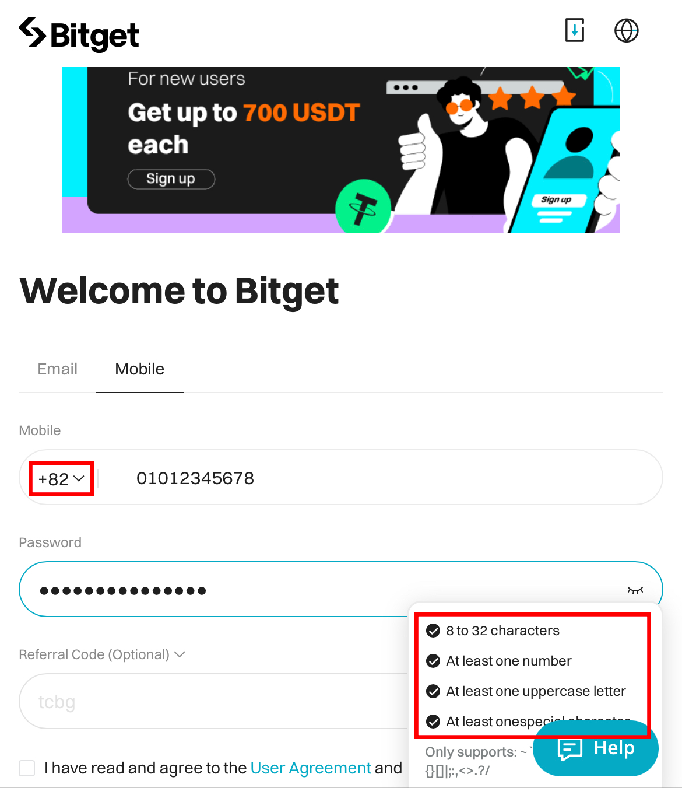
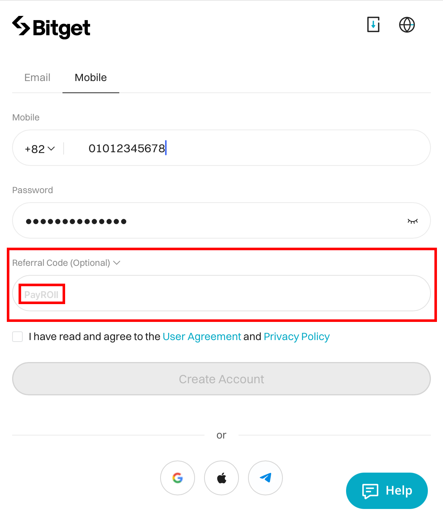
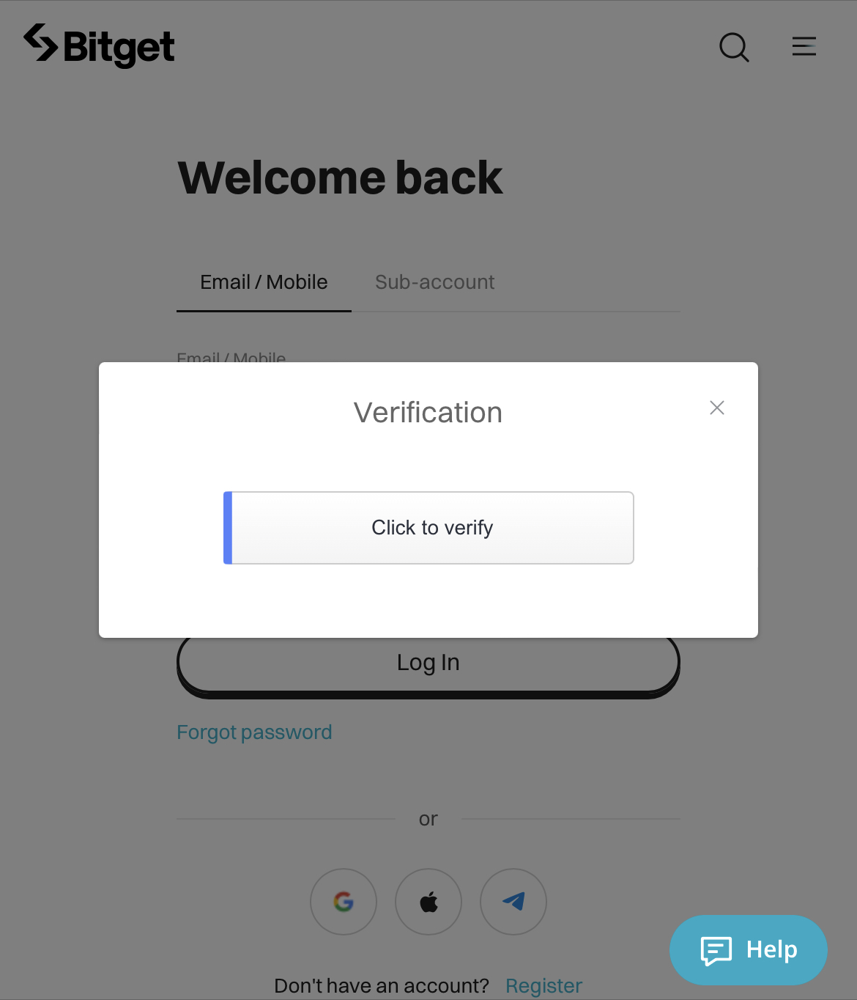
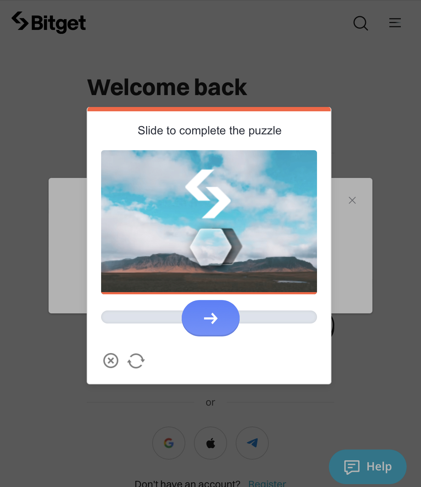
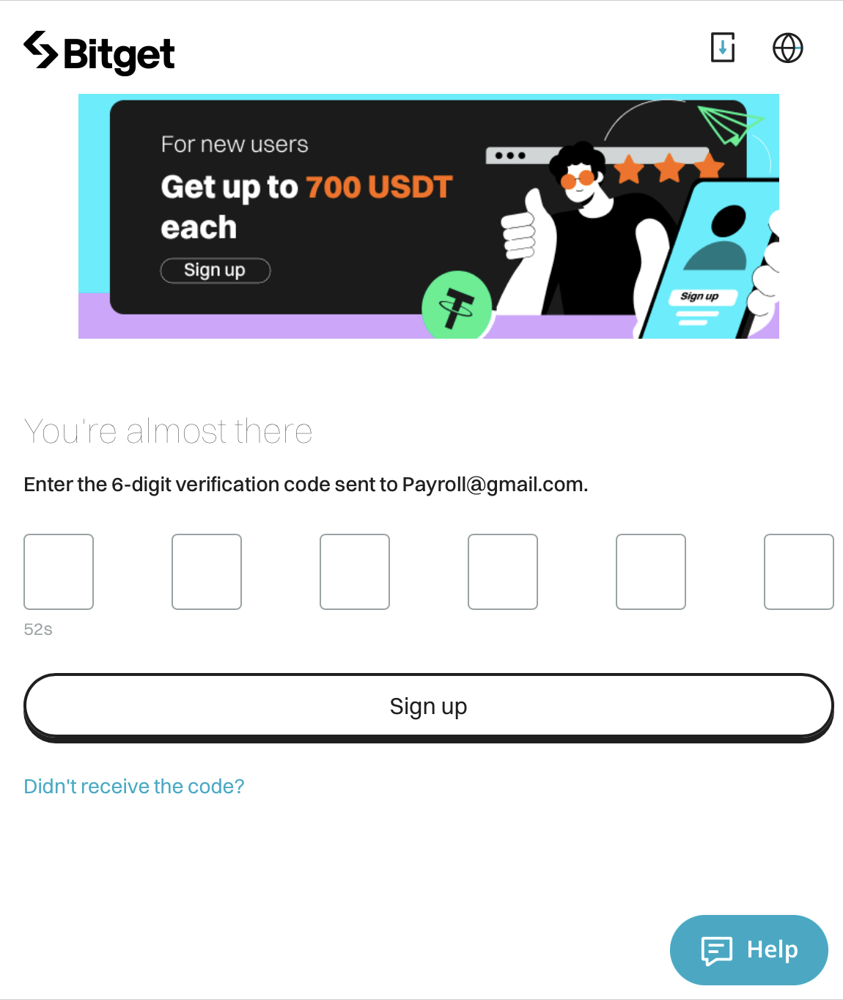
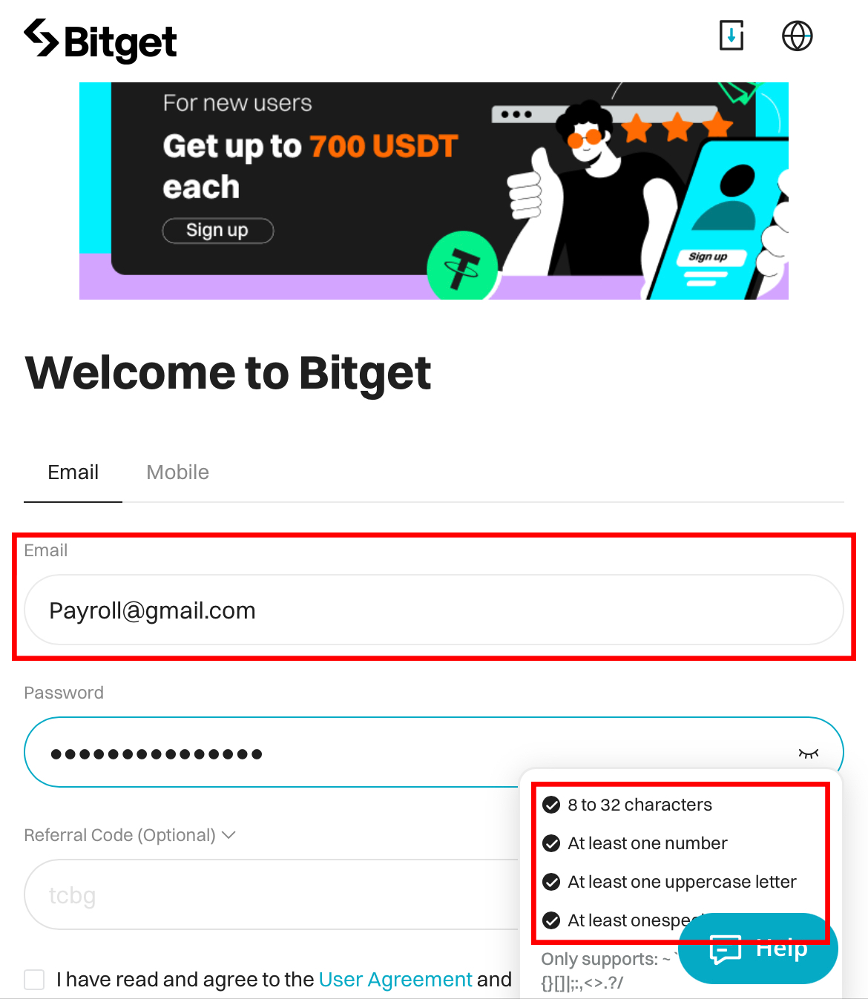
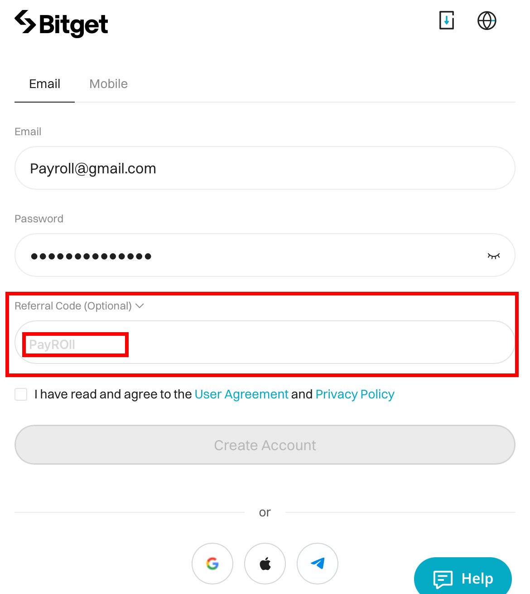
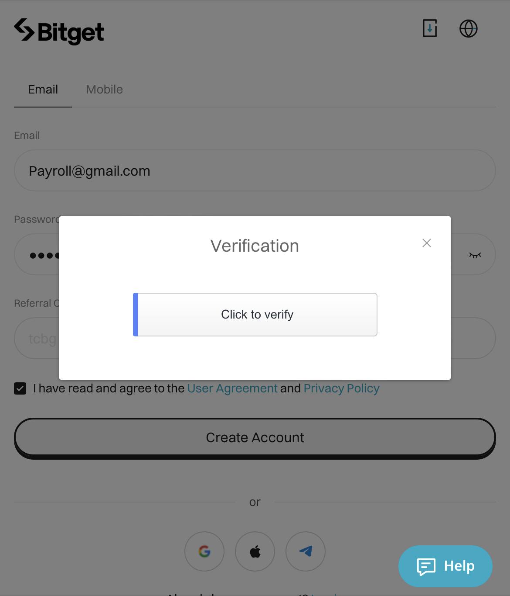
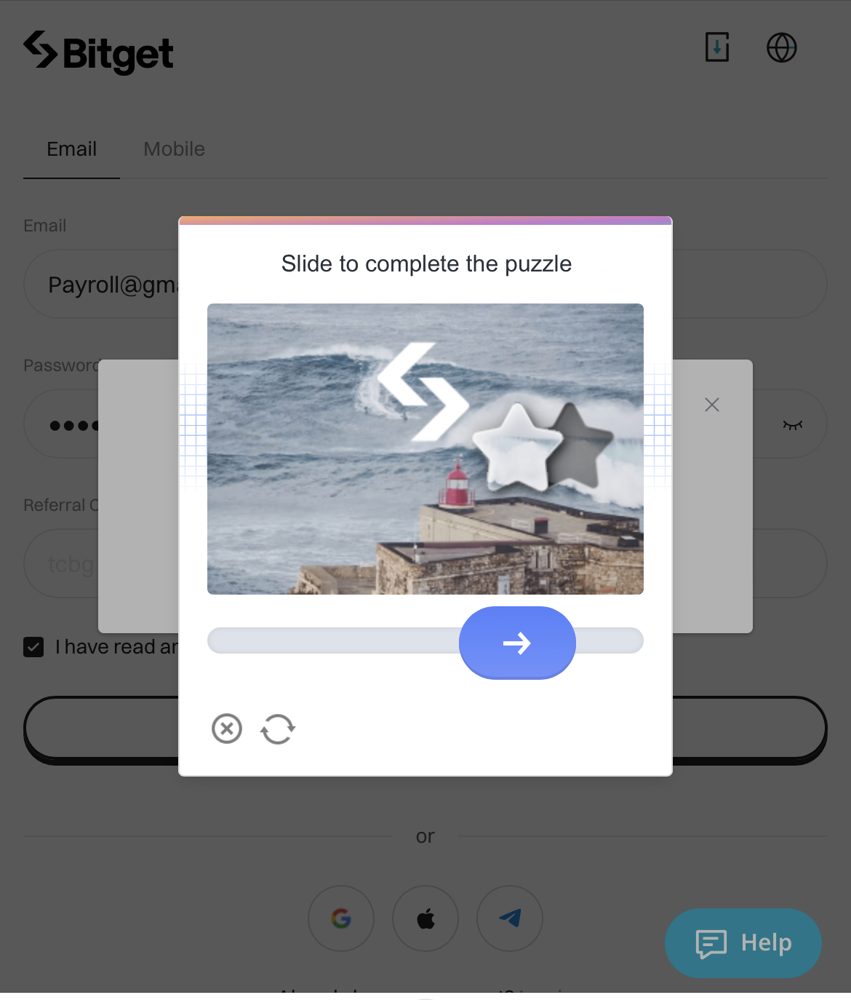

# 🖥 Bitget 웹에서 시작하기


가입하실 이메일 또는 모바일 연락처 (신규등록) 를 준비해주세요!


↓ 현재 트레이더님께서 주로 쓰시고자 하시는 주소로 선택하여 진행해보겠습니다! ↓




1. 연락처의 010 작성 전, +82 ( 대한민국 통신번호 )로 설정 되어 있는 지 확인해주세요!
2.  비밀번호는 꼭 조건에 맞게 작성해주세요!

    * 8개에서 32개까지의 문자
    * 적어도 1개의 숫자는 꼭 배열
    * 적어도 1개의 대문자는 꼭 배열
    * 적어도 1개의 특수문자 꼭 배열

    <figure><figcaption></figcaption></figure>

3. 레퍼럴  코드 꼭 확인하기!!!

계정 만들기 버튼 (Create Account) 전, 레퍼럴 코드를 확인해주세요!!

\[ Referral Code (Optional) : PayROll ] 로 되어있어야 합니다!

*

    <figure><figcaption></figcaption></figure>
* Not an AI 인증하기
*

    

    <figure><figcaption></figcaption></figure>

     

    <figure><figcaption></figcaption></figure>

    

* 트레이더님 본인 당사자 인증하기

작성하였던 트레이더님의 이메일 계정에 전달된&#x20;

Bitget 메세지에서 6자리의 숫자를 입력하세요!

*

    <figure><figcaption></figcaption></figure>




1.  이메일 주소를 형식에 맞게 작성해주세요!

    ex) Payroll@gmail.com / @naver.com / @daum.net /...
2.  비밀번호는 꼭 조건에 맞게 작성해주세요!

    * 8개에서 32개까지의 문자
    * 적어도 1개의 숫자는 꼭 배열
    * 적어도 1개의 대문자는 꼭 배열
    * 적어도 1개의 특수문자 꼭 배열

    <figure><figcaption></figcaption></figure>

3. 레퍼럴 코드꼭 확인하기!!!

계정 만들기 버튼 (Create Account) 전, 레퍼럴 코드를 확인해주세요!!

\[ Referral Code (Optional) : PayROll ] 로 되어있어야 합니다!

*

    <figure><figcaption></figcaption></figure>
* Not an AI 인증하기
*

    

    <figure><figcaption></figcaption></figure>

     

    <figure><figcaption></figcaption></figure>

    

* 트레이더님 본인 당사자 인증하기

작성하였던 트레이더님의 이메일 계정에 전달된&#x20;

Bitget 메세지에서 6자리의 숫자를 입력하세요!

*

    <figure><figcaption></figcaption></figure>



🎉 &#x20;

CONGRATULATIONS! 축하드립니다!

Bitget 의 신규계정을 만들었습니다!&#x20;

&#x20;                                                         🎉

← 더 많은 페이백을 위한 다음 단계로 가볼까요?

[Broken link](broken-reference "mention")
