# 🖥 Bitget 웹에서 시작하기

<figure><figcaption></figcaption></figure>

간단하게 Bitget 에서 볼 수 있는 트레이더님의 정보를 보겠습니다!

* BGUSR - 12A45B78 = Bitget 유저 정보
* UID - 1234567890 = 페이백을 위해서 꼭 필요한 유저 정보

그럼 본격적으로 시작해보겠습니다!


KYC 인증 (본인인증)이 되지 않은 신분증을 준비해주세요!


1. ID Verfication (본인인증)&#x20;

USER 정보 아이콘 클릭 후, ID Verification 메뉴 누르기!

<figure>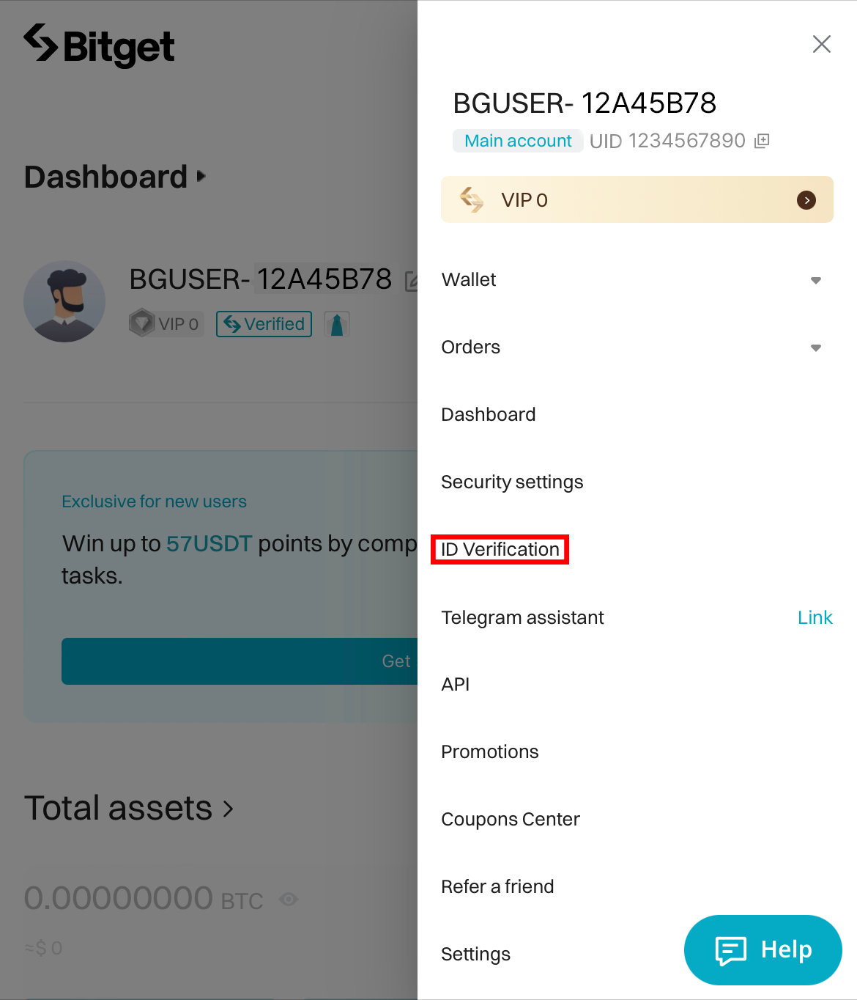<figcaption></figcaption></figure>

2. 본인인증 본격적으로 시작하기!

Level 1 Verification 박스 하단 Verify 버튼 누르기

* 본인인증을 위한 필요서류

&#x20;     1\) 정부인증 아이디 (주민등록증 / 운전면허증 / 여권 등)

&#x20;     2\) 얼굴인증 (아이디와 대조를 위한 필수 과정)

<figure><figcaption></figcaption></figure>


Level 2 Verification 은 Withdrawl (단위인출) 을 키우기 위한 인증으로,

페이백을 위한 필수는 아닙니다!

*

    <figure>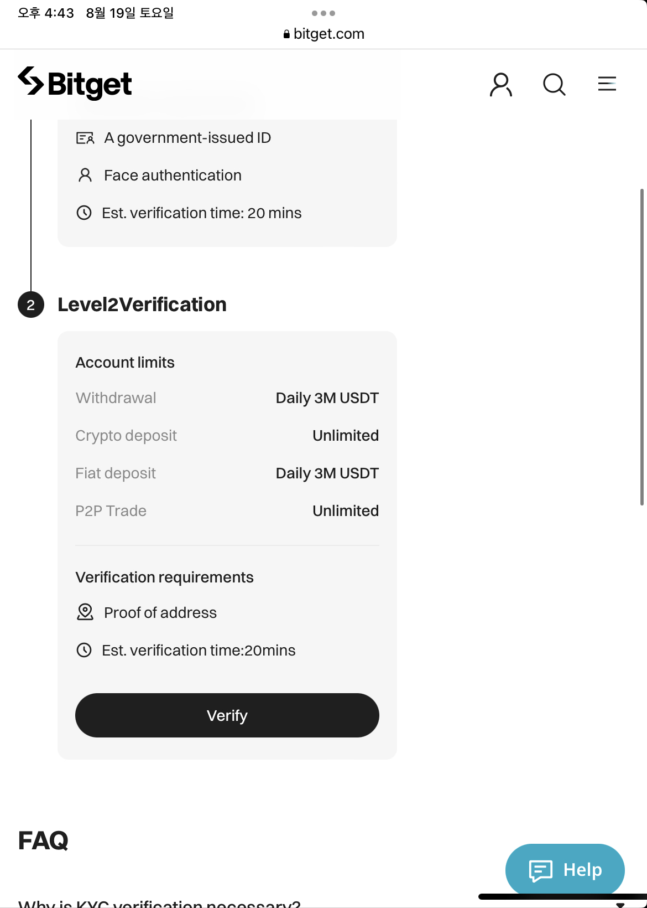<figcaption></figcaption></figure>


3. 기본 본인인증하기

* First name (성)
* Last name (이름)

<figure>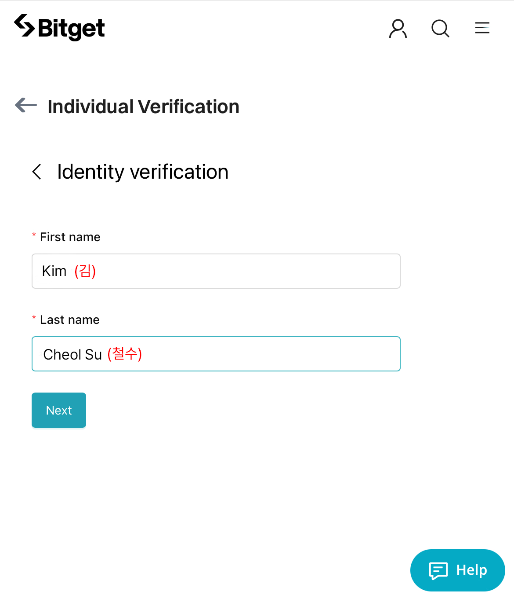<figcaption></figcaption></figure>

4. 사는 지역 선택하기

Korea, South 선택하기

<figure>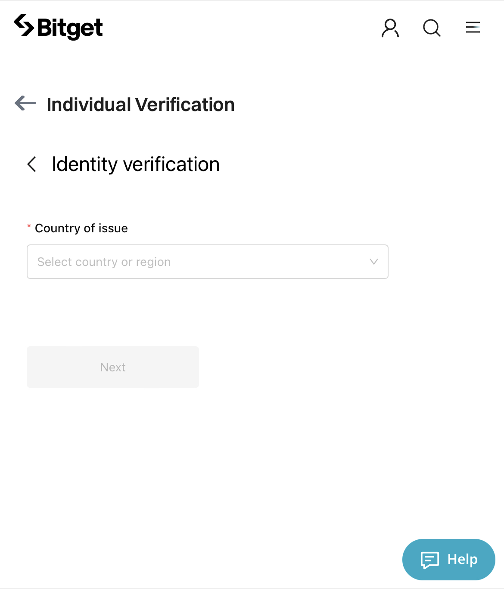<figcaption></figcaption></figure>

 

<figure>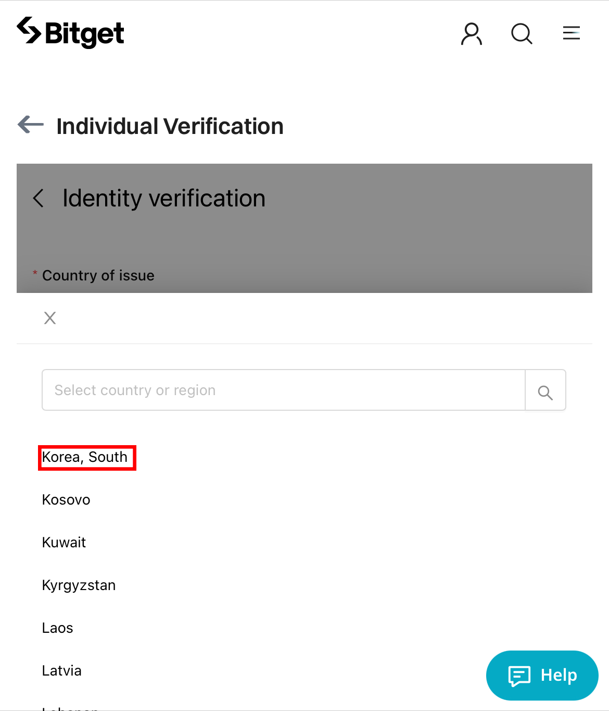<figcaption></figcaption></figure>

5. 신분인증 시작하기

국가 지원 인증된 신분증 종류를 확인하기 위한

&#x20;Korea (Republic of) | 한국 -  국적 선택하기

<figure>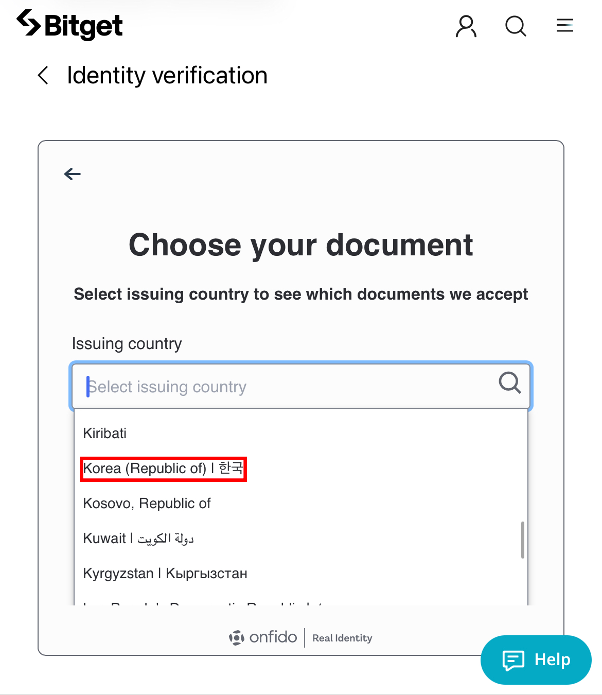<figcaption></figcaption></figure>

6. 한국에서 유효한 신분증 선택하기

* Passport (여권)
* Driver's Licence (운전면허증)
* Identity Card (주민등록증)

<figure>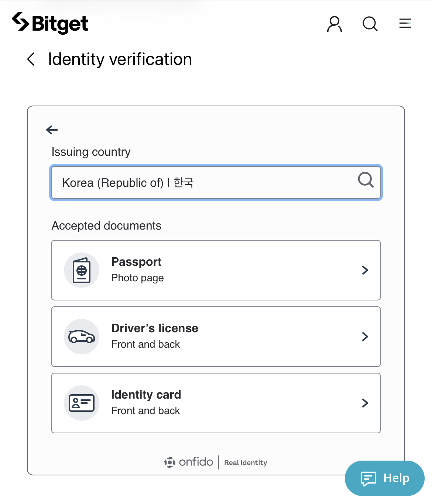<figcaption></figcaption></figure>

6. 선택한 신분증 인증하기

ex) 운전면허증으로 시작 - 앞면과 뒷면 모두 사진 촬영 필수!

<figure>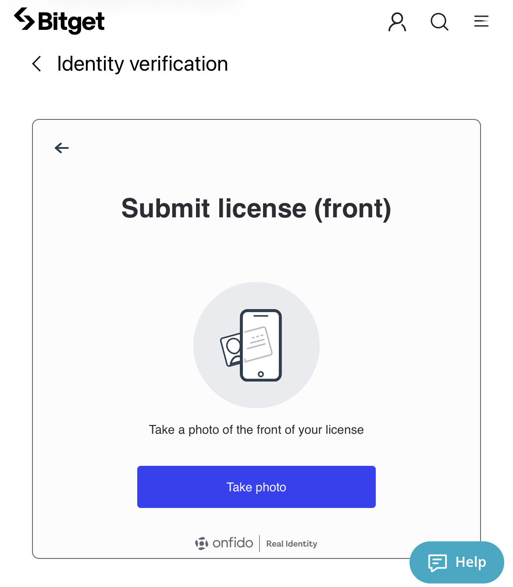<figcaption></figcaption></figure>

 

<figure>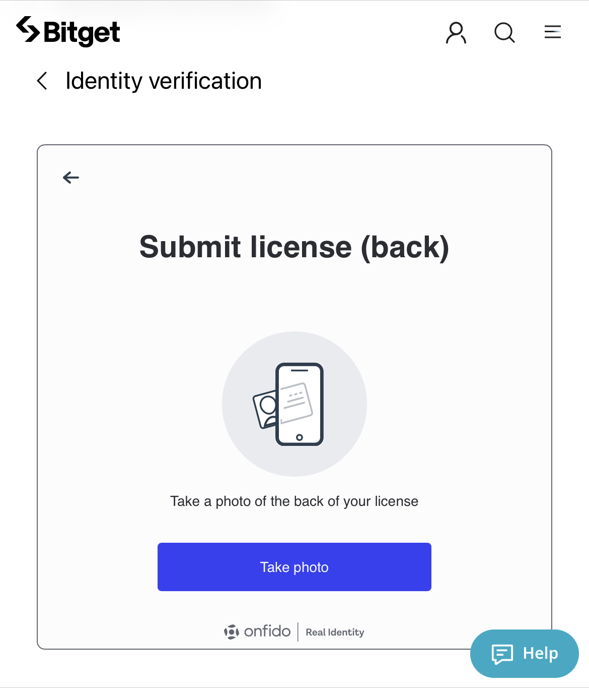<figcaption></figcaption></figure>

7. 제시된 신분증의 트레이더님의 사진과 대조하기 위한 셀카 촬영!

⚠만약, 신분증 상에서 안경을 벗고 있는 모습이라면,&#x20;

&#x20;   확실한 대조를 위하여 안경을 벗고 촬영해주세요!

<figure>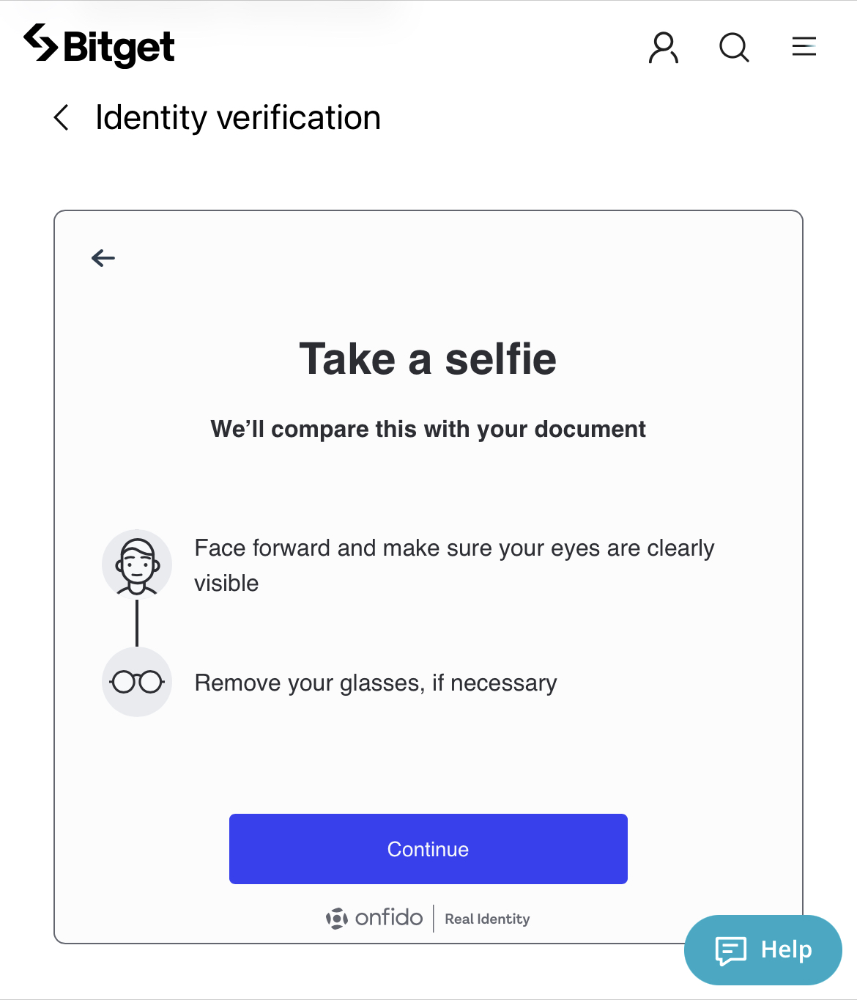<figcaption></figcaption></figure>

🎉&#x20;

CONGRATULATIONS! 축하드립니다!

Bitget 에서 본인인증을 위한 최종단계까지 끝났습니다!

수고하셨습니다.                                                                🎉


대체로 Bitget 의 본인확인 인증완료는 한 시간 내외로 완료됩니다!

*

    

    <figure>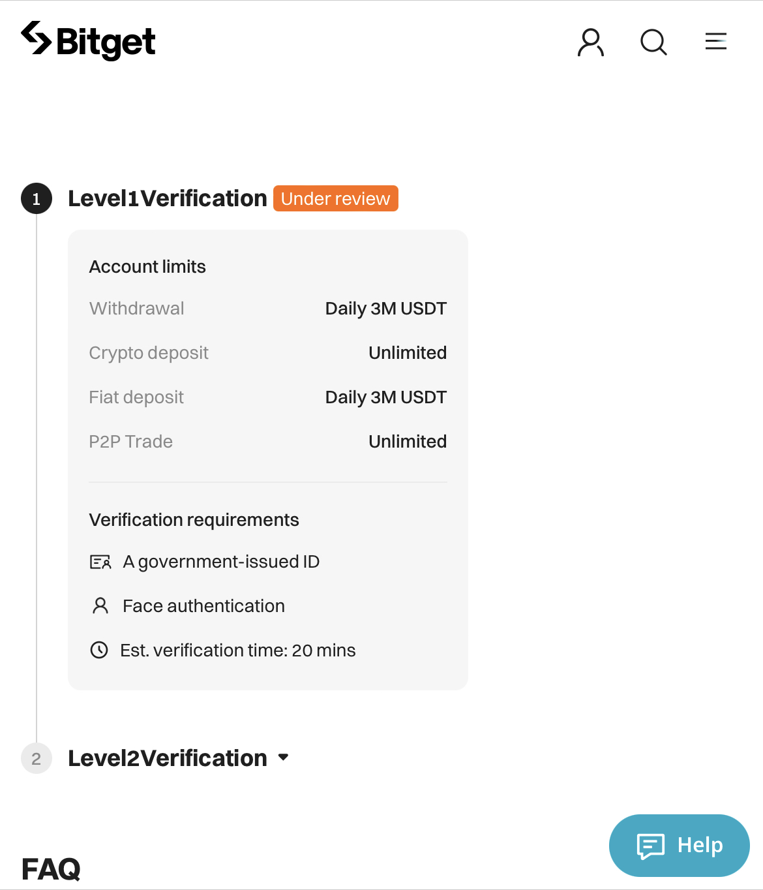<figcaption></figcaption></figure>

     

    <figure>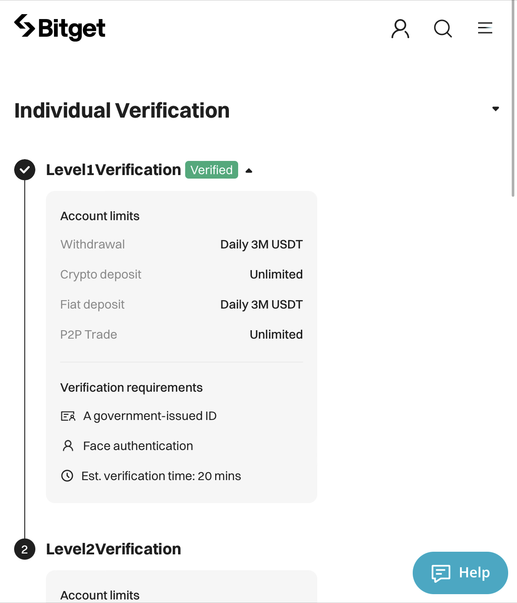<figcaption></figcaption></figure>

    



### 🛑Payroll 에서는 신규 페이백 계정 집계를 오후 8시에 진행합니다.

따라서, UID 입력 후 페이백에 대한 정보는 당일 오후 8시 이후부터 확인해주세요!

